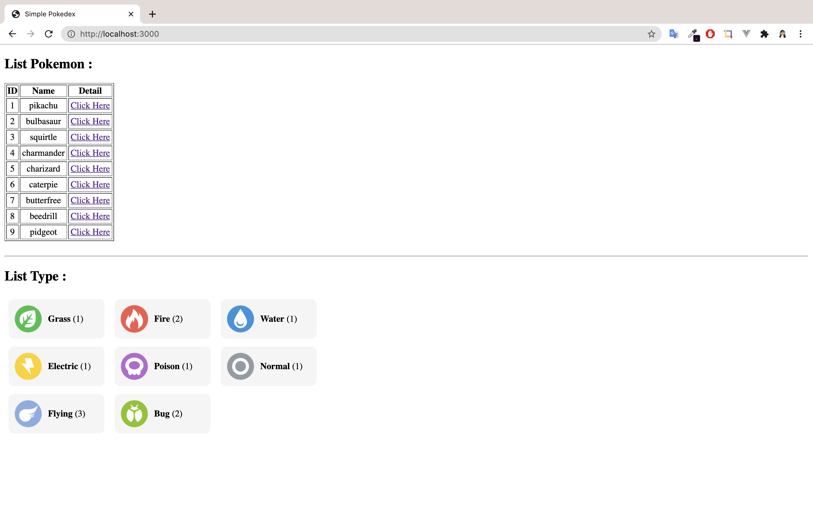

# Many to Many

<h3 style="text-decoration:underline"> Tables </h3>

- Pokemons 
- Types
- PokemonTypes (Junction Table)

### Table Pokemons

| Column      | Type    | Constraint  |
|-------------|---------|-------------|
| id          | SERIAL  | PRIMARY KEY |
| name        | VARCHAR |             |
| description | VARCHAR |             |
| height      | VARCHAR |             |
| weight      | VARCHAR |             |
| createdAt   | DATE    | NOT NULL    |
| updatedAt   | DATE    | NOT NULL    |


### Table Types

| Column      | Type    | Constraint  |
|-------------|---------|-------------|
| id          | SERIAL  | PRIMARY KEY |
| name        | VARCHAR |             |
| description | VARCHAR |             |
| symbol      | VARCHAR |             |
| color       | VARCHAR |             |
| createdAt   | DATE    | NOT NULL    |
| updatedAt   | DATE    | NOT NULL    |


### Table PokemonTypes

| Column    | Type    | Constraints                                              |
|-----------|---------|----------------------------------------------------------|
| id        | SERIAL  | PRIMARY KEY                                              |
| PokemonId | INTEGER | NOT NULL <br> FOREIGN KEY <br> ON DELETE CASCADE <br> ON UPDATE CASCADE |
| TypeId    | INTEGER | NOT NULL <br> FOREIGN KEY <br> ON DELETE CASCADE <br> ON UPDATE CASCADE |
| power     | INTEGER |                                                          |
| createdAt | DATE    | NOT NULL                                                 |
| updatedAt | DATE    | NOT NULL                                                 |
  
> **ON DELETE & ON UPDATE** read to [Sequelize Documentation](https://sequelize.org/master/manual/assocs.html#-code-ondelete--code--and--code-onupdate--code-) 


<hr style="border-top:dotted 5px black"/>


## Routes

| Method    | Route                   | Description                                                                           |
|-----------|-------------------------|---------------------------------------------------------------------------------------|
| GET       | /                       | Menampilkan seluruh nama pokemon berserta id dengan table &  seluruh type dengan list |
| GET       | /pokemons/:id           | Menampilkan halaman berisi satu data pokemon berdasarkan id dan terdapat form juga.   |
| POST      | /pokemons/:id/add/types | Menambahkan data PokemonTypes sesuai input form                                       |


## Images 


<hr style="border-top:dotted 5px black"/>

##  Eager Loading & Lazy Loading

</br>
<h2 style="text-align:center;color:teal">------ CASE ------</h2>


### Eager Loading

> Use `option.include` in static method for read (findAll, findOne, findByPk, etc.)




### Lazy Loading

> Use instance method   
> **Note :** method provide by sequelize from method associate ( in model ) with output promise (async)   
> Read Documentation [Polymorphic lazy loading Sequelize V.6](https://sequelize.org/master/manual/polymorphic-associations.html#polymorphic-lazy-loading)


<p>- Use <b style="color:salmon;">getTypes</b> ⬇️ </p>


<p>- Code example method <b style="color:salmon;">getImages</b></p>

```js
const {Pokemon} = require('./models')
Pokemon.findByPk(2)
.then(data => {
  console.log(data)
  // data is instance of Pokemon, lazy loading using instance method.
  return data.getImages() // getModel() or getModels() method name define by the associate
})
.then(data => {
  console.log(data)
})
.catch(err => {
  console.log(err)
  console.log('ERROR!!!')
})
```


